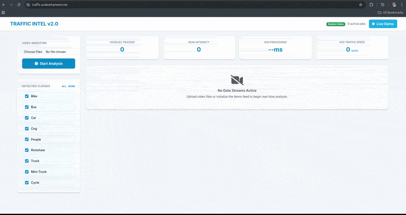

# Traffic Intelligence — Real-Time Traffic Analysis with YOLOv8 + ByteTrack

A real-time traffic monitoring system that detects, tracks, and analyzes vehicles and pedestrians in video streams via a browser-based dashboard. Built with a custom-trained YOLOv8n model on Bangladeshi urban traffic.



<!-- Replace with an actual screenshot or GIF of the running app -->

---

## Features

- **Real-time object detection & tracking** — YOLOv8n + ByteTrack, streamed frame-by-frame to the browser
- **9 traffic classes** — Bike, Bus, Car, CNG, People, Rickshaw, Truck, Mini-Truck, Cycle
- **Live class filtering** — toggle classes on/off mid-stream without restarting
- **Speed estimation** — per-vehicle speed in km/h via pixel displacement tracking
- **KPI dashboard** — cumulative vehicle count, peak frame density, avg inference latency, avg traffic speed
- **Chart.js visualizations** — live object density bar chart + temporal flow line chart per stream
- **Multi-stream support** — process multiple videos simultaneously
- **GPU/CPU auto-detection** — runs on CUDA if available, falls back to CPU

---

## Tech Stack

| Layer | Technology |
|-------|-----------|
| Backend | FastAPI, Uvicorn, WebSockets |
| ML / CV | Ultralytics YOLOv8, ByteTrack, OpenCV, PyTorch |
| Frontend | Vanilla JS, Bootstrap 5, Chart.js |
| Inference | YOLOv8n (3M params, 8.2 GFLOPs), FP16 on CUDA |

---

## Getting Started

### Prerequisites

- Python 3.10+
- `models/best.pt` — the custom-trained model file (see [Model](#model) section)

### Installation

```bash
git clone https://github.com/abrarCSE29/traffic-detection-yolo
cd traffic-detection-yolo

python -m venv .venv
source .venv/bin/activate       # Windows: .venv\Scripts\activate

pip install -r requirements.txt
```

### Run

```bash
python main.py
```

Open `http://localhost:8000` in your browser.

For development with auto-reload:

```bash
uvicorn main:app --reload --host 0.0.0.0 --port 8000
```

---

## Model

The detection model (`models/best.pt`) is a YOLOv8n fine-tuned on a custom dataset of Bangladeshi urban traffic captured from roadside cameras.

| Property | Value |
|----------|-------|
| Architecture | YOLOv8n |
| Parameters | 3,012,603 |
| GFLOPs | 8.2 |
| Classes | 9 |
| Inference size | 480px |
| Tracker | ByteTrack |

**Classes:** `Bike · Bus · Car · Cng · People · Rickshaw · Truck · Mini-Truck · Cycle`

The model file is not included in the repository due to size. Place it at `models/best.pt` before running.

---

## How It Works

```
Browser                         Server
  │                                │
  ├─ POST /upload ────────────────►│  Save video, create job
  │◄───────────────── {job_id} ───┤
  │                                │
  ├─ WS /ws/{job_id} ────────────►│  Spawn inference thread
  │                                │    └─ YOLO.track() with ByteTrack
  │                                │    └─ Post-process + JPEG encode (ThreadPool)
  │                                │    └─ Push to asyncio.Queue
  │◄──── JSON metadata ───────────┤  Per-frame counts, speed, progress
  │◄──── Binary JPEG blob ────────┤  Annotated frame
  │                                │
  ├─ filter_update (JSON) ────────►│  Hot-swap class filters mid-stream
```

- Each WebSocket connection runs its own YOLO model instance on a dedicated thread
- Visualization and JPEG encoding are offloaded to a `ThreadPoolExecutor` to overlap with the next inference call
- The browser alternates between JSON metadata and binary blobs, rendering frames via `URL.createObjectURL`

---

## API

| Method | Endpoint | Description |
|--------|----------|-------------|
| `GET` | `/` | Serves the dashboard |
| `GET` | `/classes` | Returns available detection classes |
| `POST` | `/upload` | Upload video file, returns `job_id` |
| `POST` | `/demo-job` | Create job from built-in demo video |
| `WS` | `/ws/{job_id}` | Real-time frame + metadata stream |

FastAPI's interactive API docs are available at `/docs`.

---

## Project Structure

```
traffic-detection-yolo/
├── main.py                 # FastAPI app — routes, WebSocket handler, inference pipeline
├── templates/
│   └── index.html          # Single-page dashboard (Bootstrap 5 + Chart.js)
├── models/
│   ├── best.pt             # Custom-trained YOLOv8n (gitignored)
│   └── yolov8n.pt          # Base YOLOv8n weights
├── demo_video/
│   ├── demo.mp4            # Built-in demo feed
│   └── dataset.yaml        # Class definitions
├── uploads/                # Uploaded videos (gitignored)
└── results/                # Processed outputs (gitignored)
```

---

## Configuration

| Variable | Default | Description |
|----------|---------|-------------|
| `target_fps` | `15` | Target streaming frame rate |
| `jpeg_quality` | `60` | JPEG encode quality (speed vs. quality) |
| `frame_skip` | `fps / 15` | Source frames skipped per inference |
| `imgsz` | `480` | Inference resolution |
| `conf` | `0.3` | Detection confidence threshold |
| `iou` | `0.5` | NMS IoU threshold |
| `PX_TO_METER` | `0.05` | Pixel-to-meter ratio for speed estimation |

These are set in `main.py`. A `.env` file is supported via `python-dotenv`.
